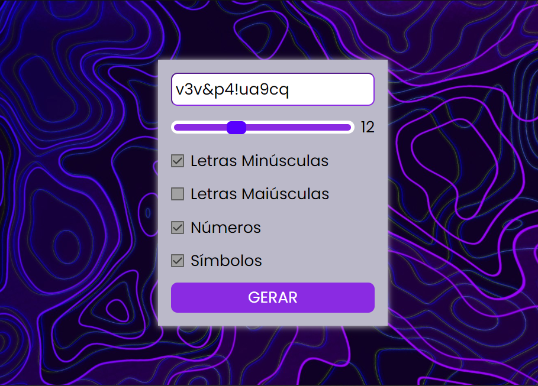

<h1 align="center"> Gerador de Senhas </h1>

<h3 align="center">
  <a href="https://grandest-nothing.github.io/Gerador-Senha/">Acesse Meu App</a>
</h3>

 

  

## 🚀 Tecnologias

Esse projeto foi desenvolvido com as seguintes tecnologias:

- HTML e CSS
- JavaScript
- Git e GitHub

## 💻 Projeto

Um gerador de senhas aleatórias para criar senhas fortes, podendo usar letras maiúsculas, minúsculas, números e caracteres especiais.
